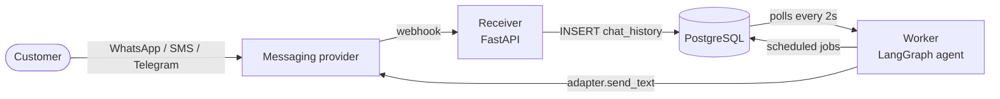
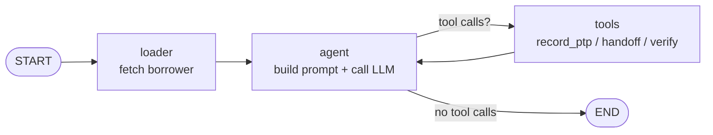

# collectkit

> An open-source template for empathetic billing-reminder chatbots —
> LangGraph ReAct agent, multimodal payment-proof verification, pluggable
> WhatsApp / SMS / Telegram. Adapt persona, prompts, and business rules
> in YAML — not Python.

[](LICENSE)

[](Dockerfile)
[](https://langchain-ai.github.io/langgraph/)

> Battle-tested in consumer lending. The same agent handles billing
> questions, records Promises to Pay, verifies payment screenshots, and
> gracefully escalates to a human — across any language, currency, or
> timezone.

---

## See it in action

A real exchange the default bot ("Maya", for the fictional "Acme Pay")
can hold today. For two more — "I already paid" with a screenshot, and a
graceful handoff — see [docs/EXAMPLE_CONVERSATION.md](docs/EXAMPLE_CONVERSATION.md).

> **Alex** — Hey, when is my bill due again?

> **Maya** — Hi Alex! Your Acme Pay bill of **$1,070.00** is due on
> **Feb 7, 2026** — that's 5 days from now. Want me to send payment
> instructions?

> **Alex** — Not today, money's tight. I can pay on the 9th, payday.

> **Maya** — Totally understand. I've recorded a Promise to Pay for
> **$1,070.00 on Feb 9, 2026**. I'll check back with you then. Thanks Alex!

Behind the scenes Maya called the `record_promise_to_pay` tool. The
empathetic, low-pressure tone is configured in
[`prompts/en/strategies.yaml`](prompts/en/strategies.yaml), not hard-coded.

<!--
  Drop a sanitized real-world screenshot here for a stronger first impression:
  
-->

---

## Inside the bot

Every technique below is wired into the agent that runs in production —
not a sketch.

- **Dynamic system prompt per turn.** The prompt is rebuilt for every
  message, injecting the customer's live state (days late, outstanding
  amount, PTP history, account status) and selecting one of ten
  status-tier strategies (5 UPCOMING tiers, 5 OVERDUE tiers, 1 PAID).
  Tone shifts from "empathetic" on day-1 overdue to "formal" at 31+
  days without a single `if` branch in Python.
  → [`src/agent.py`](src/agent.py), [`prompts/en/strategies.yaml`](prompts/en/strategies.yaml)

- **ReAct loop with vetted tools.** The LLM can only call four
  business-logic tools — `record_promise_to_pay`, `get_ptp_history`,
  `request_human_handoff`, `schedule_payment_verification`. Each tool
  enforces business rules server-side (max PTP days, currency formatting,
  state transitions); the model cannot invent commitments or skip the
  rules. → [`src/agent.py`](src/agent.py)

- **Multimodal payment-proof verification.** When a customer sends a
  screenshot of a bank transfer, the agent routes it through
  Qwen3-VL-235B-A22B-Instruct (via OpenRouter) for OCR and structured
  extraction. A scheduled checker then confirms the transaction against
  the back office before marking the bill PAID.
  → [`src/image_analyzer.py`](src/image_analyzer.py), [`src/payment_checker.py`](src/payment_checker.py)

- **Two-tier guardrails.** Input is filtered through 17
  prompt-injection regex patterns (e.g. "ignore previous instructions",
  jailbreak markers). Output is validated against a 50-keyword
  on-topic vocabulary with a length-aware skip threshold so short
  conversational replies aren't false-positived. All patterns live in
  YAML and tune without a code change.
  → [`src/guardrails.py`](src/guardrails.py), [`prompts/en/guardrails.yaml`](prompts/en/guardrails.yaml)

- **Stateful, recoverable conversations.** Multi-turn state is
  checkpointed to PostgreSQL via LangGraph's PostgreSQL saver, so the
  worker can crash, restart, or scale horizontally and pick up any
  conversation mid-flight. A 4-second debounce window also aggregates
  fragmented mobile messages into a single coherent turn before the
  agent runs. → [`src/agent.py`](src/agent.py), [`src/worker.py`](src/worker.py)

- **Locale-aware prompt bundles.** Every customer-facing string lives
  in `prompts/<locale>/` plus `config/persona.yaml`. Babel formats
  currency and dates per locale (`Rp 1.000.000,00` vs `$1,000,000.00`).
  Switching markets is a YAML edit, not a Python change.
  → [`src/config.py`](src/config.py), [`src/i18n.py`](src/i18n.py)

- **Observability built in.** LangSmith tracing is wired in for full
  prompt + tool-call inspection (toggle via `LANGCHAIN_TRACING_V2`),
  New Relic for worker health, and structured JSON logs throughout.
  → [`.env.example`](.env.example), [`src/logging_config.py`](src/logging_config.py)

<!--
  Optional: a LangSmith trace screenshot lands well here.
  
-->

---

## Try it in 15 minutes

You don't need a real WhatsApp / Twilio / Telegram account. The default
`null` messaging adapter logs replies instead of sending them, so the
whole loop works end-to-end with just an LLM key.

```bash
git clone <your-fork-url>
cd collectkit
cp .env.example .env       # set OPENROUTER_API_KEY; leave MESSAGING_PROVIDER=null
docker compose up --build
```

In another terminal:

```bash
docker compose exec worker python3 scripts/add_test_employees.py
curl -X POST http://localhost:8000/webhook \
  -H "Content-Type: application/json" \
  -d '{"phone_number":"15555550101","content":"when is my bill due?","sender_name":"Alex"}'
docker compose logs -f worker
```

You'll see the worker pick up the message, call the LLM, and "send" a
reply through the null adapter. Full walkthrough:
[docs/QUICKSTART.md](docs/QUICKSTART.md).

---

## Customizing for your business

Three config layers, in order of how often you'll touch them:

1. **`.env`** — credentials, locale, timezone, currency, messaging
   provider, schedules.
2. **`config/persona.yaml`** — bot name, company, product, business
   rules (accepted payment methods, partial-payment policy, late-fee
   policy, etc.).
3. **`prompts/<locale>/`** — system prompt, follow-up templates,
   guardrails, day-late strategies, reminder campaigns.

Switching the same bot from English/USD to Spanish/EUR is a five-line
diff in `.env`:

```bash
PROMPT_DIR=prompts/es                 # copy prompts/en/ and translate
PERSONA_CONFIG=config/persona.yaml    # your filled-in persona
LOCALE=es_ES
CURRENCY_CODE=EUR
TIMEZONE=Europe/Madrid
```

Maya's reply from the example above then becomes:

> **Maya** — ¡Hola Alex! Tu factura de Acme Pay de **1.070,00 €** vence
> el **7 feb 2026** — faltan 5 días. ¿Quieres que te envíe las
> instrucciones de pago?

Same Python, same agent, same tools — just a different prompt bundle and
a different locale code. Full guide: [docs/ADAPTING.md](docs/ADAPTING.md).

---

## Architecture

Two services share a PostgreSQL database. The **receiver** (a small
FastAPI app in [`examples/receiver/`](examples/receiver/)) accepts
provider webhooks and queues them. The **worker** (this repo's `src/`)
polls the queue, runs the agent, and replies through the configured
messaging adapter.



Inside the worker, every turn flows through a vanilla LangGraph ReAct
loop — with the wrinkle that the system prompt is rebuilt each pass to
reflect live borrower state:



Module map and node-by-node trace: [docs/ARCHITECTURE.md](docs/ARCHITECTURE.md).

---

## What's included

**Conversation features**
- LangGraph ReAct agent backed by any OpenAI-compatible LLM (default: Grok 4.1 Fast via OpenRouter)
- 4-second debounce that aggregates fragmented messages
- Promise-to-Pay recording + automatic expiry checks
- Vision-LLM payment-proof analysis (Qwen3-VL-235B)
- Polite human handoff when the bot can't help
- Prompt-injection and on-topic guardrails

**Scheduled jobs (run by the worker, in local tz)**
- Morning follow-up reminders (Mon–Sat)
- PTP expiry checks
- Bulk borrower-data sync
- PTP campaign reminders (due today / D-1 / missed)

**Messaging adapters** (set `MESSAGING_PROVIDER` in `.env`)

| Provider   | Value      | Notes                                         |
|------------|------------|-----------------------------------------------|
| Null       | `null` *(default)* | No-op; great for dev and tests        |
| Mimin.io   | `mimin`    | Hosted WhatsApp Business via omnichannel API  |
| Twilio     | `twilio`   | WhatsApp Business or SMS                      |
| Telegram   | `telegram` | Bot API                                       |

Roll your own in three steps — see [docs/PROVIDERS.md](docs/PROVIDERS.md).

---

## For production use

Before pointing real customers at this, work through the short list below
— none of it is hard, but skipping any of it will bite later.

- **Verify webhook signatures.** The reference receiver in
  [`examples/receiver/`](examples/receiver/) accepts unsigned JSON for
  dev. Add provider-specific signature checks before going live.
- **Set up observability.** LangSmith (trace prompts and tool calls) and
  New Relic (worker health / errors) are wired into the code and toggled
  via env vars — see `.env.example`.
- **Apply schema updates.** Initial schema auto-applies from
  [`docs/schema.sql`](docs/schema.sql) on first boot; later migrations
  live as idempotent scripts in [`docs/migrations/`](docs/migrations/).
- **Run the smoke tests** in CI:
  ```bash
  pip install pytest && pytest tests/ -q
  ```
- **Replace the test seed data.** [`scripts/add_test_employees.py`](scripts/add_test_employees.py)
  inserts synthetic borrowers tagged `label=TEST`. Don't run it against
  production.

---

## Documentation

- [QUICKSTART.md](docs/QUICKSTART.md) — clone to first reply in 15 min
- [EXAMPLE_CONVERSATION.md](docs/EXAMPLE_CONVERSATION.md) — three sample dialogues
- [ARCHITECTURE.md](docs/ARCHITECTURE.md) — module map, request flow, glossary
- [ADAPTING.md](docs/ADAPTING.md) — customize for your own business
- [PROVIDERS.md](docs/PROVIDERS.md) — wire up Mimin / Twilio / Telegram or add your own
- [CONTRIBUTING.md](CONTRIBUTING.md) — how to contribute
- [SECURITY.md](SECURITY.md) — reporting vulnerabilities

---

## Contributing

PRs welcome — see [CONTRIBUTING.md](CONTRIBUTING.md). For security
issues, please follow [SECURITY.md](SECURITY.md) instead of opening a
public issue.

## License

[MIT](LICENSE). Copyright (c) 2026 contributors.
